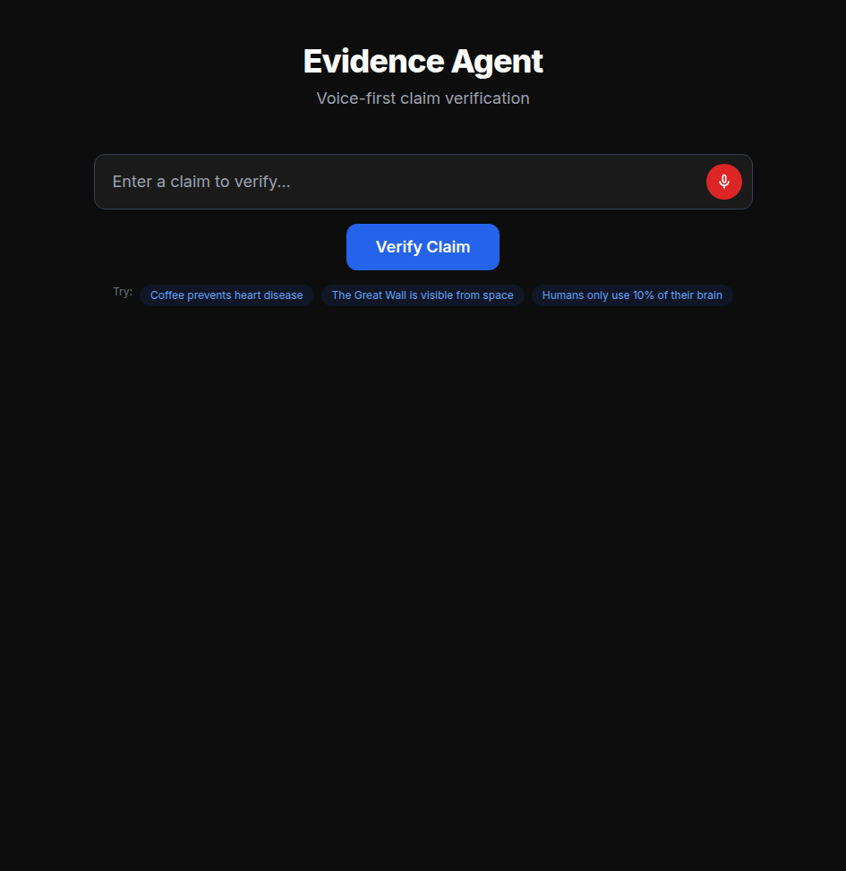
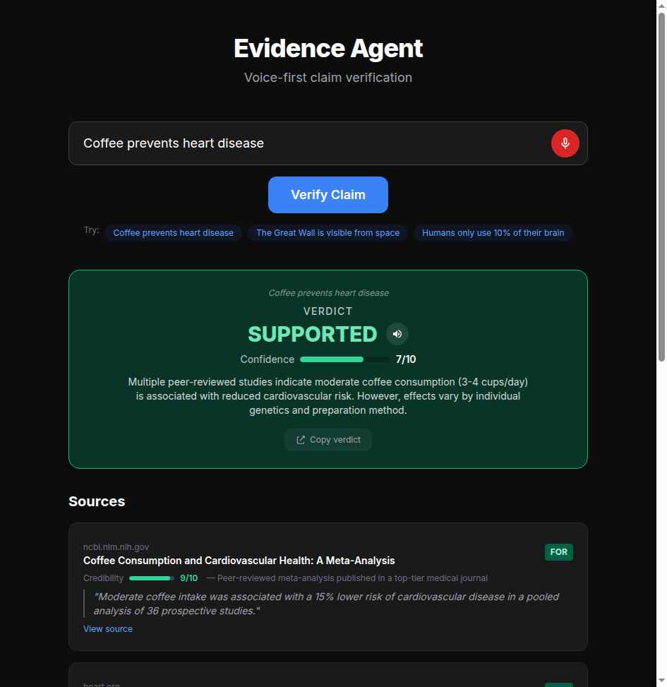
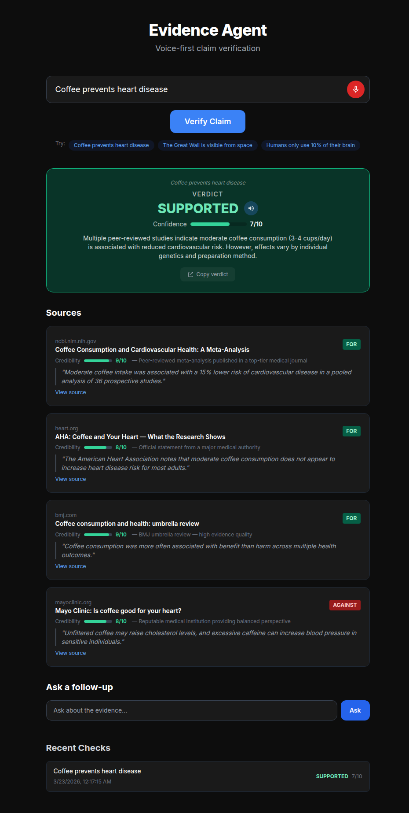

# Evidence Agent — Hackathon Submission

> **ElevenLabs + Firecrawl Hackathon | March 2026**

## What It Does

Evidence Agent is a voice-first claim verification tool. Speak or type any claim — "Coffee prevents heart disease," "The Great Wall is visible from space" — and the agent searches the web, classifies sources by stance and credibility, and delivers a spoken verdict.

The full pipeline:

```
Claim → Decompose (3 search queries) → Firecrawl search → Claude classification → Verdict → ElevenLabs narration
```

## How It Uses ElevenLabs

Evidence Agent uses ElevenLabs in **two ways**:

### 1. Browser TTS (verdict narration)
Every verdict is **automatically narrated** via ElevenLabs TTS. When the agent finishes analyzing a claim, it synthesizes a spoken summary:

> "Verdict: SUPPORTED. Confidence: 7 out of 10. Multiple peer-reviewed studies indicate moderate coffee consumption is associated with reduced cardiovascular risk."

The voice output uses ElevenLabs' Multilingual v2 model with the Rachel voice for clear, authoritative narration. Follow-up answers are also narrated.

**Integration:** `backend/voice_synthesizer.py` — async wrapper around the TTS API.

### 2. ElevenLabs Conversational AI Agent (voice loop)
The `voice/` module implements a **full voice loop** using ElevenLabs Conversational AI Agents:

- User speaks a claim into the mic
- ElevenLabs Agent handles STT, then calls a `verify_claim` tool
- The tool hits the Evidence Agent backend (`POST /verify`)
- The agent speaks the verdict back via ElevenLabs TTS

This creates a completely hands-free fact-checking experience — speak a claim, hear the verdict.

**Integration:** `voice/run_voice_agent.py` — ElevenLabs `Conversation` SDK with `ClientTools` for tool calling.

## How It Uses Firecrawl

Firecrawl powers the evidence-gathering step. When a claim comes in:

1. Claude decomposes it into 3 diverse search queries (covering different angles)
2. Firecrawl searches all 3 queries concurrently, returning full page content (not just snippets)
3. Results are deduplicated by URL and capped at 8 sources

The full markdown content from Firecrawl enables deep source classification — the agent can extract verbatim quotes and assess credibility based on actual article content, not just titles.

**Firecrawl integration:** `backend/firecrawl_client.py` — async search with markdown scraping.

## Architecture

| Layer | Tech | Purpose |
|-------|------|---------|
| Frontend | Vanilla JS + Tailwind | Dark mode UI, Web Speech API input, SSE streaming |
| Backend | FastAPI (Python) | Orchestrates the pipeline, serves SSE events |
| Search | Firecrawl API | Web search + full-page markdown extraction |
| Classification | Claude (Anthropic) | Source stance detection, credibility scoring, verdict synthesis |
| Voice Output | ElevenLabs TTS | Spoken verdict narration |
| Voice Input | Web Speech API | Browser-native speech recognition |
| Voice Loop | ElevenLabs Conversational AI | Full STT→verify→TTS agent with tool calling |

## Key Features

- **Streaming pipeline** — SSE events show each step live (decompose, search, classify, synthesize)
- **Source credibility scoring** — each source rated 1-10 with explanation (domain authority, citations, writing quality)
- **Stance classification** — FOR, AGAINST, or NEUTRAL per source
- **Follow-up Q&A** — ask questions about the evidence after verification
- **Voice loop** — speak a claim, hear the verdict, ask follow-ups by voice
- **Claim history** — localStorage-backed recent checks
- **Copy verdict** — one-click shareable text
- **Mock mode** — `MOCK_MODE=1` runs the full UI without API keys (for demos)

## Screenshots

| State | Screenshot |
|-------|-----------|
| Empty (ready for input) |  |
| Verdict with sources |  |
| Full page (verdict + sources + follow-up + history) |  |

## Running It

### Quick Demo (no API keys needed)

```bash
cd backend
pip install -r requirements.txt
MOCK_MODE=1 uvicorn main:app --port 8000

# In another terminal:
cd frontend
python -m http.server 3000
# Open http://localhost:3000
```

### Full Pipeline

```bash
cd backend
cp .env.example .env
# Add your keys: FIRECRAWL_API_KEY, ANTHROPIC_API_KEY, ELEVENLABS_API_KEY
uvicorn main:app --reload --port 8000
```

## API Keys Required (Full Mode)

| Key | Source | Purpose |
|-----|--------|---------|
| `FIRECRAWL_API_KEY` | [firecrawl.dev](https://firecrawl.dev) | Web search + scraping |
| `ANTHROPIC_API_KEY` | [console.anthropic.com](https://console.anthropic.com) | Claim decomposition, source classification, verdict |
| `ELEVENLABS_API_KEY` | [elevenlabs.io](https://elevenlabs.io) | Voice narration of verdicts |
| `ELEVENLABS_AGENT_ID` | ElevenLabs dashboard | Voice loop agent (optional — for `voice/` module) |

## Repo

- **GitHub:** [MurchE/evidence-agent](https://github.com/MurchE/evidence-agent)
- **Branch:** `development`
